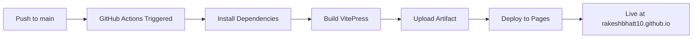

# 🚀 Code Crew - Deployment Summary

## ✅ What's Been Set Up

### 1. GitHub Actions Workflow
- **File:** `.github/workflows/deploy-docs.yml`
- **Triggers:** 
  - Automatic on push to `main` (when `docs/**` changes)
  - Manual via workflow dispatch
- **Actions:**
  - Builds VitePress documentation
  - Deploys to GitHub Pages
  - Uses pnpm for package management

### 2. VitePress Configuration
- **File:** `docs/.vitepress/config.mts`
- **Changes:**
  - ✅ Set `base: '/opencode-code-crew/'` for GitHub Pages
  - ✅ Updated title to "Code Crew - Multi-Agent Plugin"
  - ✅ Updated GitHub links to your repository
  - ✅ Updated copyright year to 2024-2026

### 3. Documentation
- **`GITHUB_PAGES_SETUP.md`** - Complete setup guide
- **`.github/PAGES_QUICKSTART.md`** - Quick reference
- **`CLEAN_HISTORY_SCRIPT.sh`** - Tool to clean git history (if needed)

### 4. Helper Scripts
- **`push-to-github.sh`** - Interactive push helper
- **`GITHUB_PUSH_GUIDE.md`** - Troubleshooting guide
- **`SECRET_BYPASS_INSTRUCTIONS.md`** - Secret scanning bypass guide
- **`PUSH_ISSUE_RESOLVED.md`** - Issue summary

---

## 🎯 Next Steps

### Step 1: Resolve Secret Scanning Issue

**Quick Fix (Recommended):**
1. Visit: https://github.com/rakeshbhatt10/opencode-code-crew/security/secret-scanning/unblock-secret/37evyuGT0wp3Z0Y69RYLMmJxKB8
2. Click "Allow secret"
3. Run: `git push -u origin feature/initial-code`

**Alternative (Clean History):**
```bash
./CLEAN_HISTORY_SCRIPT.sh
git push --force-with-lease origin feature/initial-code
```

### Step 2: Merge to Main

```bash
# Option A: Via GitHub (Recommended)
# 1. Create PR on GitHub
# 2. Review and merge

# Option B: Via Command Line
git checkout main
git merge feature/initial-code
git push origin main
```

### Step 3: Enable GitHub Pages

1. Visit: https://github.com/rakeshbhatt10/opencode-code-crew/settings/pages
2. Set **Source** to: `GitHub Actions`
3. Save

### Step 4: Watch Deployment

1. Go to: https://github.com/rakeshbhatt10/opencode-code-crew/actions
2. Watch "Deploy Documentation to GitHub Pages" workflow
3. Wait ~2-3 minutes

### Step 5: View Your Live Docs! 🎉

```
https://rakeshbhatt10.github.io/opencode-code-crew/
```

---

## 📋 Deployment Checklist

- [ ] Secret scanning issue resolved
- [ ] Code pushed to GitHub
- [ ] PR created (if using feature branch)
- [ ] Merged to `main` branch
- [ ] GitHub Pages enabled (source: GitHub Actions)
- [ ] Workflow completed successfully
- [ ] Docs accessible online
- [ ] Updated README with docs link
- [ ] Added website to repository settings

---

## 🔄 Future Updates

Every time you push to `main`:
1. GitHub Actions automatically triggers
2. VitePress builds your docs
3. Site deploys to GitHub Pages
4. Changes are live in ~2-3 minutes

**No manual deployment needed!** ✨

---

## 📚 Documentation Structure

```
docs/
├── .vitepress/
│   ├── config.mts          # VitePress configuration
│   └── theme/              # Custom theme (if any)
├── public/                 # Static assets
├── *.md                    # Documentation pages
└── package.json            # Dependencies

.github/
└── workflows/
    └── deploy-docs.yml     # GitHub Actions workflow
```

---

## 🎨 Customization

### Update Site Title
Edit `docs/.vitepress/config.mts`:
```typescript
title: 'Your New Title'
```

### Update Base Path
If you rename the repository:
```typescript
base: '/new-repo-name/'
```

### Update Theme Colors
Edit `docs/.vitepress/config.mts`:
```typescript
head: [
  ['meta', { name: 'theme-color', content: '#your-color' }]
]
```

---

## 🔍 Troubleshooting

### Workflow Not Running
- Check GitHub Pages source is "GitHub Actions"
- Verify you pushed to `main` branch
- Check Actions tab for errors

### 404 Errors
- Verify `base` path matches repo name
- Should be: `base: '/opencode-code-crew/'`

### Build Failures
- Check Actions logs for specific errors
- Ensure all dependencies are in `package.json`
- Verify `pnpm-lock.yaml` is committed

---

## 📊 What Happens on Each Push



---

## 🎉 Success Metrics

Once deployed, you'll have:
- ✅ Professional documentation site
- ✅ Automatic deployments
- ✅ Search functionality
- ✅ Mobile-responsive design
- ✅ Dark/light mode
- ✅ Edit on GitHub links
- ✅ Last updated timestamps
- ✅ Social sharing metadata

---

## 🌟 Bonus: Add Badge to README

Once deployed, add this badge to your `README.md`:

```markdown
[](https://rakeshbhatt10.github.io/opencode-code-crew/)
```

---

## 📞 Support

- **GitHub Pages Docs:** https://docs.github.com/en/pages
- **VitePress Docs:** https://vitepress.dev/
- **GitHub Actions Docs:** https://docs.github.com/en/actions

---

## 🎯 Current Status

**Branch:** `feature/initial-code`  
**Status:** Ready to push (after resolving secret scanning)  
**Next Action:** Allow secret and push to GitHub

---

**Let's get your docs live! 🚀**

Follow the "Next Steps" above to deploy your documentation to GitHub Pages.

